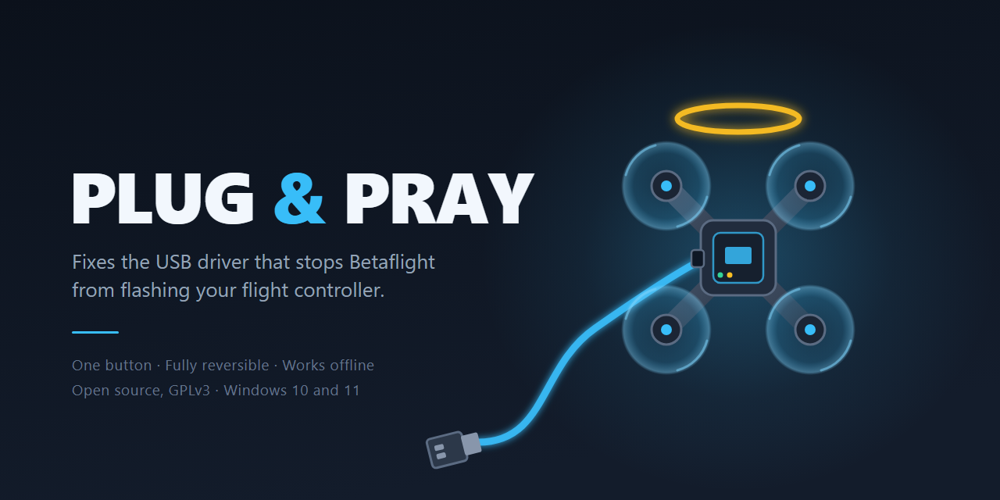

# Plug & Pray

**Fixes the Windows USB driver that stops Betaflight Configurator from flashing your flight controller.**

Named after the Windows feature that was supposed to make this automatic. It doesn't.

One button. It looks at your board, tells you in plain English what is actually wrong,
and fixes only that. If it can't help, it says so instead of guessing.

---

## Does this fix my problem?

If any of these sound familiar, yes:

* `No DFU device found` when you try to flash firmware
* `Failed to open serial port`
* **STM32 BOOTLOADER** sitting in Device Manager with a yellow exclamation mark
* Betaflight sees your board fine, but the moment it reboots to flash, it vanishes
* You fixed this once with Zadig, then Windows updated and broke it again

None of that means your board is dead. It is a Windows driver problem, and it is
fixable in about ten seconds.

## Why this keeps happening

Windows picks drivers based on a USB device's ID, and your flight controller has **two
different identities** depending on what it is doing:

| Board state | Windows sees | Driver it needs | Used for |
|---|---|---|---|
| Running normally | Virtual COM port (`0483:5740`) | `usbser` (built into Windows) | Changing settings in Betaflight |
| Bootloader / DFU | STM32 BOOTLOADER (`0483:DF11`) | **WinUSB** | Flashing firmware |

Windows treats those as two unrelated devices. It usually gets the first one right and
the second one wrong, which is why your board connects perfectly right up until the
moment you try to flash it.

Betaflight talks to the bootloader through libusb, and libusb on Windows can only reach
a device that has WinUSB bound to it. So "install the correct driver" really means
"install the one that gets out of the way".

## Quick start

1. Download `PlugAndPray.exe` from the [Releases](../../releases) page.
2. Plug your flight controller in with a **data** USB cable (see below, this trips up more
   people than anything else).
3. Run it and click the button it offers you. It needs Administrator because installing a
   driver does.

That's it. Then open Betaflight Configurator and flash.

## What it changes on your PC

This is an Administrator tool that installs a driver, so you deserve to know exactly what
it touches. Nothing here is hidden.

### 1. The driver

It binds Microsoft's **WinUSB** driver to your board's bootloader. WinUSB already ships
with Windows. Nothing is downloaded, and no third-party kernel driver is installed.

Plug & Pray **only ever touches the bootloader device.** It will not modify a healthy COM
port, so it cannot break your normal Betaflight connection. That is a deliberate design
rule, and it is the main thing separating this from pointing Zadig at whatever is in the
dropdown.

### 2. A certificate (please read this bit)

Windows will not accept a driver package unless it is signed. To do that, Plug & Pray
(using **libwdi**, the same engine Zadig runs on) generates a certificate, signs the
driver catalogue with it, and adds that certificate to your **Trusted Root** and
**Trusted Publisher** stores.

Adding anything to your root store is a big deal, so here is exactly what that
certificate is:

* Its name is scoped to a single device, for example
  `CN=USB\VID_0483&PID_DF11 (libwdi autogenerated)`
* Its only permitted use is **Code Signing**
* **The private key is destroyed immediately after signing.** Nobody, including us, can
  ever use this certificate to sign anything else

It exists so Windows will accept one driver package for one device, and it is useless for
anything beyond that. Zadig and the original ImpulseRC tool did exactly the same thing
without mentioning it. We would rather tell you.

**Undo removes the certificate too.**

### 3. Nothing else

No network connections of any kind. No telemetry, no analytics, no update checks, no
account. The app works fully offline and never sends anything anywhere. You can verify
that yourself: there is no networking code in this repository.

## Undo

Everything is reversible. When your board is set up, the app offers
**Undo (remove installed driver)**, which removes the driver package it installed and the
certificate it added, returning your PC to how it was.

It also cleans up **all** matching driver packages, not only the last one. If you have
used Zadig or the old ImpulseRC tool over the years, your machine may have several stacked
up, and removing only the top one just lets Windows fall back to the next.

## If it says "No flight controller detected"

Nine times out of ten this is your **USB cable**. A lot of cables, especially the ones
that come with chargers and small electronics, carry power but no data. Your board's LEDs
light up, so it looks connected, but the PC cannot see it at all.

Try a different cable that you know does data. Then try a different USB port, ideally one
directly on the motherboard rather than a hub or a front-panel port.

If the board still doesn't appear, it may need its physical **BOOT** button held while you
plug it in.

## What it does not do

* It does not flash firmware. Use Betaflight Configurator for that. This only fixes the
  driver so Configurator can do its job.
* It does not touch your board's settings, PIDs, rates, or anything on the flight
  controller itself. It changes Windows, not your quad.
* It does not support AT32 or GD32 based boards yet (see Status below).

## Status and honest caveats

* Tested on **Windows 11 x64** with STM32 flight controllers that have native USB
  (F4, F7 and H7 class chips). There is no ARM64 build.
* **Not code signed yet.** Windows SmartScreen will show an "unknown publisher" warning.
  You will need to click "More info" then "Run anyway". A signing certificate is on the
  list. In the meantime, the source is all here, and you can build it yourself.
* Support for **AT32 and GD32** boards is stubbed out but deliberately switched off,
  because we have not verified their USB IDs against real hardware. We would rather
  support nothing than claim support we have not tested.
* The **"restore normal-mode driver"** repair, for boards where Zadig replaced the serial
  driver, is implemented but has not yet been tested against a genuinely damaged board.

## For the curious: how it works

1. **Look.** Enumerate USB and identify the board and its current driver.
2. **Diagnose.** Work out which of a handful of known states you are in, and decide
   whether there is anything worth doing.
3. **Kick (only if needed).** If the board is running normally, send it a Betaflight MSP
   `reboot to bootloader` command over its serial port so it re-enumerates in DFU mode.
   No BOOT button required on boards that support it.
4. **Fix.** Generate a device specific WinUSB driver package with libwdi, sign it, and
   install it against the bootloader device only.
5. **Verify.** Re-scan and confirm Windows really did bind WinUSB, rather than trusting
   a return code.

There is also a command line version, `fcfix.exe`, for scripting and for people who
prefer a terminal:

```
fcfix diagnose     show what is detected and what would be done
fcfix list         list flight controller related USB devices
fcfix fix          do the recommended thing (needs Administrator)
fcfix undo         remove the driver and certificate we installed
fcfix kick COM6    reboot a board into bootloader mode
```

## Building from source

You need the .NET 8 SDK and Visual Studio 2022 Build Tools with the
"Desktop development with C++" workload.

```powershell
git clone <this repo>
cd fc-driver-fixer
./scripts/Build-LibWdi.ps1   # fetches and builds the native engine
./scripts/publish.ps1        # produces dist/PlugAndPray.exe
```

Building **libwdi** used to be the genuinely awkward part. It ships no prebuilt binaries
by design, it needs WDK 8.0 era redistributables that current WDKs no longer include, and
several of its project settings have to be changed before it will compile at all. Worse,
some of those failures are silent: miss one and you get a build that succeeds but quietly
has no WinUSB support.

`Build-LibWdi.ps1` now handles all of it. It pins the upstream commit, fetches the WDK
redistributables from Microsoft, applies each fix (with a comment explaining why), builds,
and then verifies its own output. The full archaeology, if you want to understand rather
than just build, is in [`NOTES.md`](NOTES.md).

Every release is built by [GitHub Actions](.github/workflows/build.yml) using exactly
these scripts, so what you build locally is what ships.

## Credits and licences

**The original.** The [ImpulseRC Driver Fixer](https://github.com/ImpulseRC/ImpulseRC_Driver_Fixer)
solved this problem for the FPV community for years. ImpulseRC has since closed down,
leaving an unmaintained binary with no published source. This project is an independent
rebuild, written from scratch. No ImpulseRC code was decompiled or reused.

**libwdi.** The driver installation engine is
[libwdi](https://github.com/pbatard/libwdi) by Pete Batard, licensed under the
**LGPL v3**. It is a genuinely excellent piece of work and it is what makes both Zadig and
this tool possible.

Because libwdi is LGPL, you are entitled to replace it with your own build. Releases
therefore include a zip containing `PlugAndPray.exe` with `libwdi.dll` as a separate,
replaceable file, alongside the convenient single file build.

The corresponding source for our libwdi build is fully specified by
[`scripts/Build-LibWdi.ps1`](scripts/Build-LibWdi.ps1). It pins the exact upstream commit
we build from and contains every modification we apply, each one commented with the
reason. Running that script reproduces our `libwdi.dll` byte for byte from Pete Batard's
unmodified source.

**Zadig.** Zadig is the general purpose tool that inspired this whole category, also by
Pete Batard. Its source sits inside the libwdi repository but is licensed **GPL v3**, and
none of it has been copied into this project. If you want a powerful driver tool that can
target anything, use Zadig. Plug & Pray is the narrow, cautious version for pilots who
just want their quad to flash.

**Betaflight** is referenced only to describe compatibility. This project is not
affiliated with or endorsed by the Betaflight project.

**This project is licensed under the [GNU General Public License v3](LICENSE).**

That choice is deliberate. The tool this replaces disappeared because it was closed
source and the company behind it shut down, taking the only copy of the knowledge with
it. Copyleft means that cannot happen again here. Anyone may use, study, modify and
redistribute this, and any fork has to stay open too. If this project ever goes quiet,
the community can simply pick it up and carry on.
